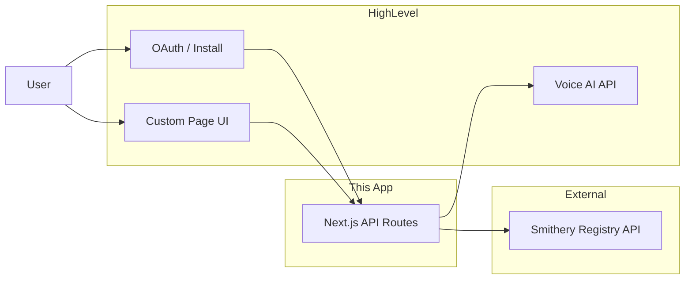

# MCP Registry Marketplace App

A HighLevel Marketplace app that acts as an **MCP Registry** for Voice AI agents: browse MCP servers from Smithery, attach them to Voice AI agents in your sub-account, and view or change attachments.

## Architecture



- **Custom Page** (React): Renders inside HighLevel after install. Calls this app’s API with session cookie; no secrets in the browser.
- **Backend** (Next.js API routes): Proxies Smithery (with server-side API key), talks to HighLevel Voice AI (list/patch agents), enforces sub-account scoping via session.
- **Smithery:** `GET /servers` (search, pagination), `GET /servers/:id` for details. Auth: Bearer token.
- **HighLevel:** OAuth for install; target user = Sub-account. Location-scoped token used for Voice AI: List Agents, Get Agent, Patch Agent (MCP config).

## Setup and run

### Prerequisites

- Node.js 18+
- HighLevel Marketplace sandbox account
- [Smithery API key](https://smithery.ai/account/api-keys)

### Install

```bash
npm install
cp .env.example .env
# Edit .env with your keys (see below).
```

### Environment variables

| Variable | Description |
|----------|-------------|
| `SMITHERY_API_KEY` | Smithery API key (server-only). |
| `GHL_CLIENT_ID` | HighLevel OAuth client ID. |
| `GHL_CLIENT_SECRET` | HighLevel OAuth client secret. |
| `GHL_OAUTH_REDIRECT_URI` | OAuth callback URL (e.g. `https://your-app.vercel.app/api/auth/ap/callback`). |
| `GHL_SCOPES` | Optional; e.g. `locations.readonly`. |
| `NEXT_PUBLIC_APP_URL` | Public app URL (e.g. `https://your-app.vercel.app`) for redirects. |
| `SESSION_SECRET` | Optional. Secret for signing the session cookie (defaults to `GHL_CLIENT_SECRET`). Set a dedicated secret in production if you prefer. |

### Run locally

```bash
npm run dev
```

- App: http://localhost:3000  
- Connect: http://localhost:3000/api/auth/ap/authorize  
- Custom Page (after auth): http://localhost:3000/custom-page  

### Tests

```bash
npm test
```

Unit tests cover Smithery client, GHL client, and error helpers. Integration tests cover the health and MCP-servers API routes (with mocked Smithery).

### Deploy (e.g. Vercel)

1. Push to GitHub and import the project in Vercel.
2. Set the env vars above in the Vercel project.
3. Set **Installation URL** in HighLevel app config to: `https://your-domain.com/api/auth/ap/authorize`.
4. Set **Custom Page URL** to: `https://your-domain.com/custom-page`.

## Governance and reliability

- **Secrets:** Smithery API key and GHL client secret only in backend env. Custom Page receives only an httpOnly session cookie.
- **Errors:** Smithery down → 503; auth failure → 401; agent not found → 404. All API errors use `{ error: string }`.
- **Idempotency:** Attach and detach are implemented via PATCH agent; safe to retry.

See [docs/governance.md](docs/governance.md) for more detail.

## Trade-offs and mocked vs real

- **No DB for attachments:** MCP–agent mapping is stored only in HighLevel agent config (Patch Agent). No separate database.
- **Session store:** In-memory by default. For production with multiple instances, use a shared store (e.g. Redis) or signed JWT in cookie.
- **Smithery in tests:** Unit and integration tests mock `fetch`; no real Smithery calls in CI.
- **GHL in tests:** GHL client is unit-tested with mocked fetch; no real OAuth or Voice AI calls in tests.

## Future improvements

- Use Smithery server detail `connections[].url` (or `deploymentUrl`) when attaching MCP so the agent gets the real MCP endpoint.
- Shared session store (Redis) or short-lived JWT for multi-instance deploy.
- Optional “verified only” filter in the UI (Smithery `is:verified`).
- Bulk attach: one MCP to multiple agents in one action.

## AI usage across the SDLC

- **PRD:** AI was used to generate the initial PRD structure (problem, users, goals, scope, risks); see [docs/PRD.md](docs/PRD.md).
- **Design:** AI was used to generate wireframes/specs for the Custom Page (MCP list, choose agent, attachments, change/detach); see [docs/wireframes.md](docs/wireframes.md).
- **Coding:** AI assisted with scaffolding the Next.js app, API routes, Smithery/GHL clients, session handling, and the Custom Page React UI.
- **Testing:** AI generated unit tests for Smithery and GHL clients and error helpers, and integration tests for the health and MCP-servers routes (with mocked external APIs). Edge cases covered: missing env, 4xx/5xx from Smithery, GHL token exchange and location token.
- **Orchestration:** Implementation followed a phased plan (setup → PRD/design → core app → governance → tests → docs). Prompts were scoped per phase (e.g. “implement GET /api/mcp-servers with Smithery client and error handling”).

## Demo script (2–5 min)

1. **Install:** Open HighLevel Marketplace (sandbox), install the app into a sub-account (or use Installation URL).
2. **Open Custom Page:** From the app’s Custom Page link, land on the MCP Registry page (or connect via “Connect to HighLevel” if no session).
3. **Browse MCPs:** Use search, see name/description; click “Attach to agent” on one MCP.
4. **Choose agent:** Pick a Voice AI agent from the list; confirm attach and see success message.
5. **Current attachments:** Show the “Current MCP attachments” table with the attached MCP; use “Change” to pick another MCP, or “Detach” to remove.
6. **Tests:** Run `npm test` and show passing unit and integration tests.

## License

Private / assignment project.
